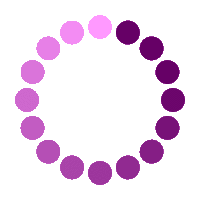

  

___
<h2 align="center">
  
  
  
  What I like to use...
  
  
  
</h2>

| Java | IntelliJ IDEA | Gradle | Maven | Junit5 | Selenide | Cucumber |
|:------:|:----:|:----:|:------:|:------:|:------:|:------:|
|  |  |  |  |  |  |  |
| GitHub | Jenkins | Bamboo | Selenoid | Allure Report | Allure TestOps | Jira |
|  |  |  |  |  |  |  |

---

  

    
    
  

---

___

<h1>
  
  
  
  Contacts 
  
  
  
</h1>

  

 
  

